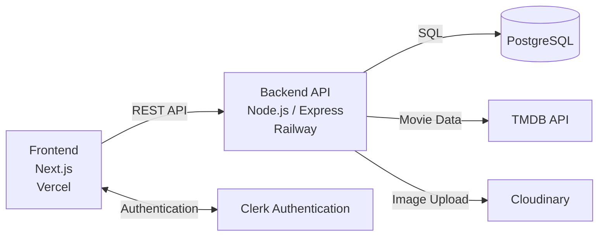

# Movie Review Platform

A full stack movie platform for discovering movies, browsing movie details, saving favorites, tracking watch list, and writing reviews.

## Features

- Movie discovery and search with TMDB
- Movie details, cast information, and watch-provider links
- Authentication and profile sync with Clerk
- Favorites, watched tracking, and reviews
- Avatar upload and edit with Cloudinary

## Tech Stack

- Next.js
- TypeScript
- Node.js
- Express.js
- Prisma
- PostgreSQL
- Clerk
- TMDB API
- Cloudinary
- Tailwind CSS
- Postman
- Figma
- Vercel
- Railway

## Project Structure

```text
frontend/
  app/                Next.js app router pages and layouts
  components/         Reusable UI and feature components
  lib/api/            Frontend API clients for backend requests
  types/              Shared frontend TypeScript types

backend/
  src/controllers/    Request handlers for movies, users, and reviews
  src/routes/         Express route definitions
  src/services/       External service integrations and business logic
  src/schemas/        Zod request validation schemas
  src/lib/            Shared backend utilities such as Prisma client
  prisma/             Database schema and migrations
```

## System Architecture




## Design Preview

Designs were prototyped in Figma before implementation. Some design references and visual assets were adapted from Figma Community resources and customized for this project.


Figma Prototype: https://www.figma.com/design/qANj437UhEpbQoy2F7C5m0/Movie.ai?node-id=0-1&t=1tfC5tjrs04VXD0z-1

## Running Locally

### Frontend

```bash
cd frontend
npm install
npm run dev
```

### Backend

```bash
cd backend
npm install
npm run dev
```

## Environment Variables

The project expects environment variables for the frontend and backend services.

### Frontend

- `NEXT_PUBLIC_API_BASE_URL`
- Clerk public configuration

### Backend

- `PORT`
- `DATABASE_URL`
- `TMDB_API_KEY`
- `CORS_ORIGIN`
- Cloudinary configuration

## Deployment

- Frontend deployed on Vercel
- Backend and database services deployed on Railway
