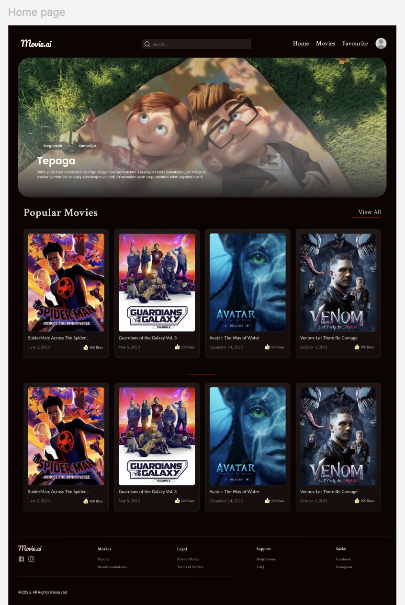
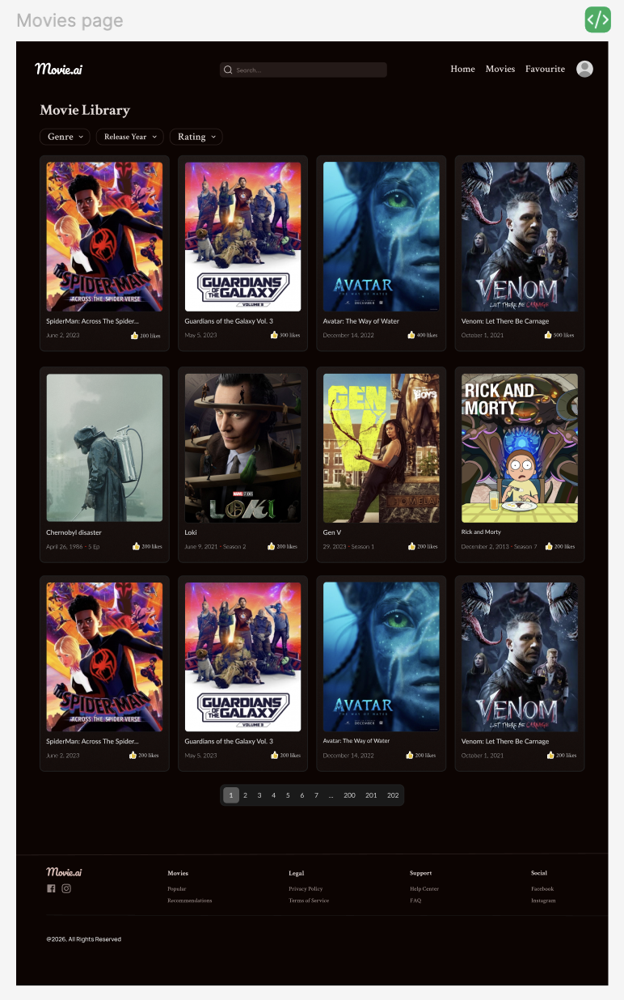
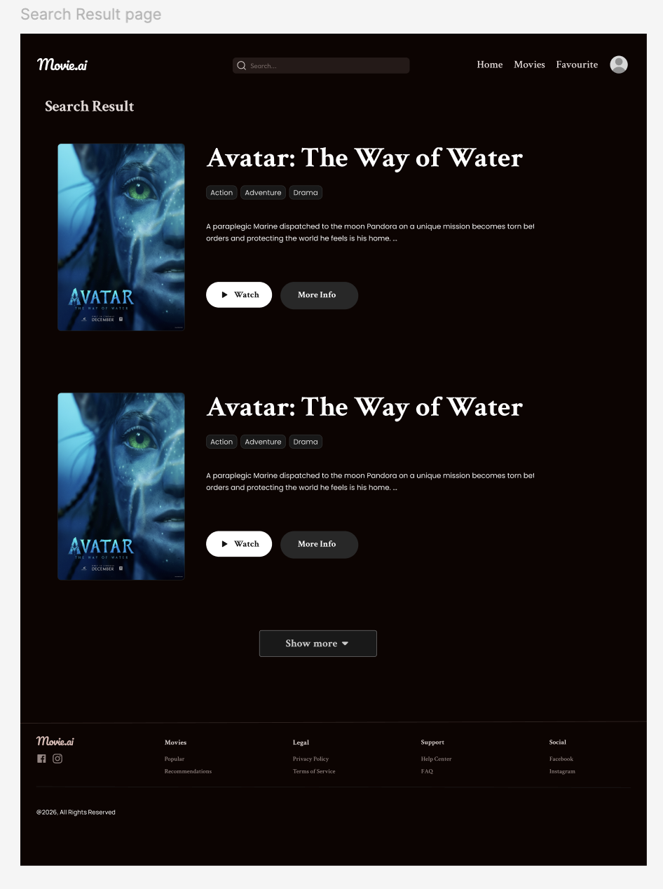

# Full Stack Movie Platform

A full stack movie platform for discovering movies, browsing movie details, saving favorites, tracking watch list, and writing reviews.

## Highlights

- Browse popular movies and search titles with TMDB data
- View movie details, cast information, and watch-provider links
- Sign up and authenticate with Clerk
- Create and sync user profiles
- Save favorite movies
- Track watched movies
- Write and delete reviews
- Upload and manage profile avatars with Cloudinary

## Tech Stack

- Next.js
- TypeScript
- Node.js
- Express.js
- Prisma
- PostgreSQL
- Clerk
- TMDB API
- Cloudinary
- Tailwind CSS
- Postman
- Figma
- Vercel
- Railway

## Project Structure

```text
frontend/   Next.js application
backend/    Express API and Prisma schema
```

## Design Preview

Designs were prototyped in Figma before implementation.







Figma Prototype: https://www.figma.com/design/qANj437UhEpbQoy2F7C5m0/Movie.ai?node-id=0-1&t=1tfC5tjrs04VXD0z-1

## Running Locally

### Frontend

```bash
cd frontend
npm install
npm run dev
```

### Backend

```bash
cd backend
npm install
npm run dev
```

## Environment Variables

The project expects environment variables for the frontend and backend services.

### Frontend

- `NEXT_PUBLIC_API_BASE_URL`
- Clerk public configuration

### Backend

- `PORT`
- `DATABASE_URL`
- `TMDB_API_KEY`
- `CORS_ORIGIN`
- Cloudinary configuration

## Deployment

- Frontend deployed on Vercel
- Backend and database services deployed on Railway
